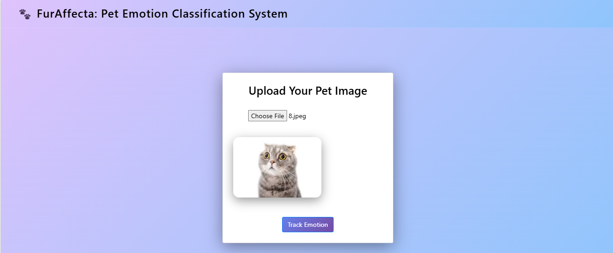

🐾 FurAffecta – Pet Emotion Classification System

📌 Overview

FurAffecta is a Machine Learning–based system that analyzes pet images and predicts their emotional state.
The system uses image processing + classical machine learning models to classify pet emotions into:
😠 Angry
😊 Happy
😨 Scared
😢 Sad
It is designed to be lightweight, fast, and efficient, without requiring high-end hardware.

🎯 Objectives

->Develop an image-based pet emotion classification system
->Implement ML models: Decision Tree, KNN, Random Forest, Logistic Regression
->Classify pet emotions into predefined categories
->Evaluate performance using standard metrics

🛠️ Technologies Used

->Python – Core programming
->OpenCV – Image preprocessing
->HOG (Histogram of Oriented Gradients) – Feature extraction
->Scikit-learn – Model training & evaluation
->NumPy – Data processing
->Matplotlib & Seaborn – Visualization
->HTML & CSS – User interface

⚙️ System Workflow

->Upload pet image
->Preprocess image (resize, grayscale, noise removal)
->Extract features using HOG
->Pass features to trained ML model
->Predict pet emotion

📊 Model Performance
Model	Test Accuracy
->Random Forest	92.23% 
->Logistic Regression	90.77%
->Decision Tree	89.05%
->KNN	49.59%
👉 Best Performing Model: Random Forest

📦 Project Structure

FurAffecta/
│── model/
│   └── pet_emotion.h5
│── static/
│── templates/
│── app.py
│── requirements.txt
│── README.md
│── LICENSE

⚙️ Setup Instructions

1. Clone the repository
git clone https://github.com/Sharanya-Aithal-KS/FurAffecta.git
cd FurAffecta

3. Install Git LFS ⚠️
This project uses Git LFS to handle large model files.
git lfs install
4. Create virtual environment
python -m venv venv

5. Activate environment
Windows:
venv\Scripts\activate
Mac/Linux:
source venv/bin/activate

6. Install dependencies
pip install -r requirements.txt

7. Run the project
python app.py

💡 Features

✔ Automatic pet emotion detection
✔ Lightweight ML model
✔ Fast prediction
✔ Simple UI
✔ Works on standard systems

✅ Advantages

->Reduces manual interpretation errors
->Fast and efficient
->Low computational requirements
->Easy to use

⚠️ Limitations

->Depends on dataset quality
->Limited feature representation (HOG)
->Not suitable for subtle emotions
->No real-time video support

🚀 Future Enhancements

->Deep learning (CNN) integration
->Real-time emotion detection
->Mobile/web deployment
->Larger dataset training

📈 Results

->Achieved up to 92% accuracy
->Stable and reliable predictions
->Efficient on low-resource systems

👩‍💻 Author
Sharanya Aithal KS

📜 License
This project is licensed under the MIT License.

⭐ Final Note
This project demonstrates how classical machine learning techniques can effectively solve real-world image classification problems with high accuracy and efficiency.

## 📸 Screenshots

### Homepage

### Prediction Results

## 🎥 Demo Video

<video width="700" controls>
  <source src="demo/FurAffecta.mp4" type="video/mp4">
</video>
